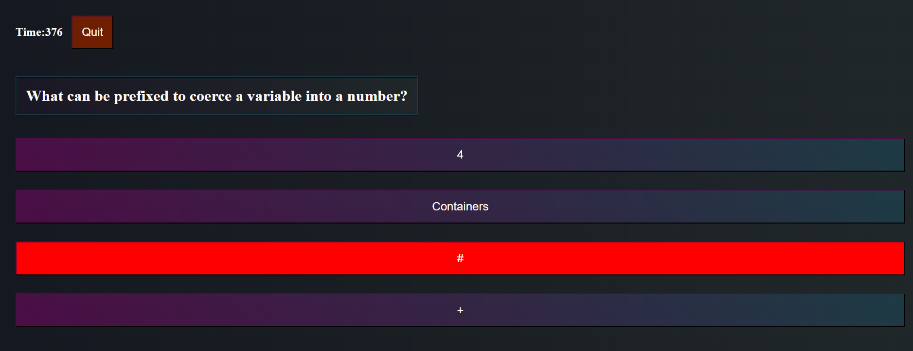

## quizknows
A (tiny) quiz for JavaScript ===> [Here](https://lord-xld3.github.io/quizknows/)

Score is saved locally

Answers are randomized, which doesn't really make sense but its kinda cool I guess

# It looks like this

# In the beginning...

We begin by solving the problem before coding anything

Now that we understand the flow, let's solve some of the smaller problems

# Immutable - things that will never change

INT loopCount

INT timerPenalty

ARR prompts(ARR prompt(STR question)(STR correctAnswer)) // each prompt contains a question and a correctAnswer

ARR wrongAnswers // can be randomly inserted into any prompt

# Mutable - things that can change

FLOAT timer

INT prompts(i) // iterate thru each prompt

INT prompt(j) // 0=question 1=answer

ARR answerList // buttons/answers to display on screen, in random order

OBJ wrongButton // text = wrongAnswers(random splice)

OBJ correctButton // text = prompts(i).prompt(1) -- grab correct answer

# Interactables

SCREEN 0:

Button(high scores) Button (start quiz)

SCREEN 1:

Button(back to SCREEN 0) Button(clear scores)

SCREEN 2:

Button(back to SCREEN 0 // quit) Buttons(answers)

SCREEN 3:

TextField(initials) Button(submit score) => SCREEN 1

# Conditionals - let's think about how it should behave more in depth

OutOfTime?=>SCREEN 0 + display "Ran out of time!"

ELSE =>SCREEN 0 + display "Press Start to begin."

WrongAnswer?=>timer-(y)

ELSE =>prompts(i++)=>generateAnswersList

# ???

We can go further in depth like describing the layout of the GUI, or think more about the structure of the program like where constants, globals, and functions will go. In this case, the layout isn't important and the structure is loosely organized with our mockup image and declarations of operation above.

# In the end...

There's many ways to skin a cat, and we're randomly splicing answers from an array until its empty, so we have to re-init the array every time we start the quiz.

Sorting the score before storing it was suprisingly easy by splicing it into local storage.

A few times I had to stop and think, "what do I actually need this data to do?" which is why we switched from a 2D array to 3 single arrays. We don't need a "prompt" array since we're already iterating thru a for loop, and two arrays are linked together by using the same index in the for loop.

